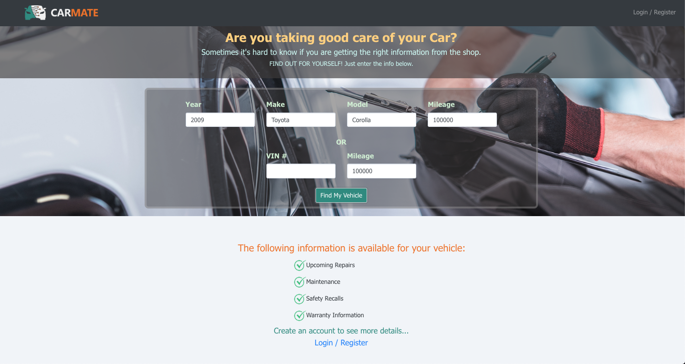

# CarMate 🚗

CarMate is a full-stack app where individuals can keep track of their vehicle's maintenance and preventative measures. Keeping track of your vehicle's maintenance will help you extend the life of your vehicle. Users can check which services are available on the landing page, then log in to their account to view and save their vehicle's service details. Data is obtained from CarMD and saved into a MongoDB database.

## Motivation

We wanted to build an app that would help a wide variety of users and came to the conclusion that car maintenance was ubiquitous. Our idea was to create an app in which users can receive and keep track of their car maintenance as it's something that people easily lose track of until it's too late.



## Tech Stack

This application was built using:

- MongoDB
- Express.js
- React.js
- Node.js

### Other Tech

Included in the application's dependencies are:

- Mongoose.js for modeling the saved data
- Passport.js using Google OAuth

## Getting Started

The following instructions will get you a copy of the project up and running on your local machine for development and testing purposes.

## Installation

```shell
$ git clone https://github.com/harpalassi/car-mate.git
$ npm i
```

## Setup `.env` file

Make sure you generate the following API keys from the appropriate website:

- CarMD API
- Google+ API for Google OAuth
- MongoDB user credentials\*

Once you have all the keys generated, create a new file in `./.env` folder, and include the keys as follows:

```env
REACT_APP_CARMD_AUTH_KEY=insertCarMDAuthKey
REACT_APP_CARMD_PARTNER_TOKEN=insertCarMDPartnerToken

GOOGLE_PLACES_API_KEY=insertGooglePlacesAPIKey

GOOGLE_USER_CLIENTID=insertGoogleUserClientID
GOOGLE_USER_CLIENTSECRET=insertGoogleUserClientSecret
MONGODB_URI=insertMongoDBURI
SESSION_COOKIE_ENCRYPT=insertSessionCookieEncrypt
```

## Running Application

Once the application dependencies are installed, and the `.env` file has been configured, run the application using the command:

```shell
npm start
```

## Team

- Ian Bunn
- Harpal Assi
- Rebeca Dodero
- Nic May

🚀 Deployed at: http://www.carmate.info
